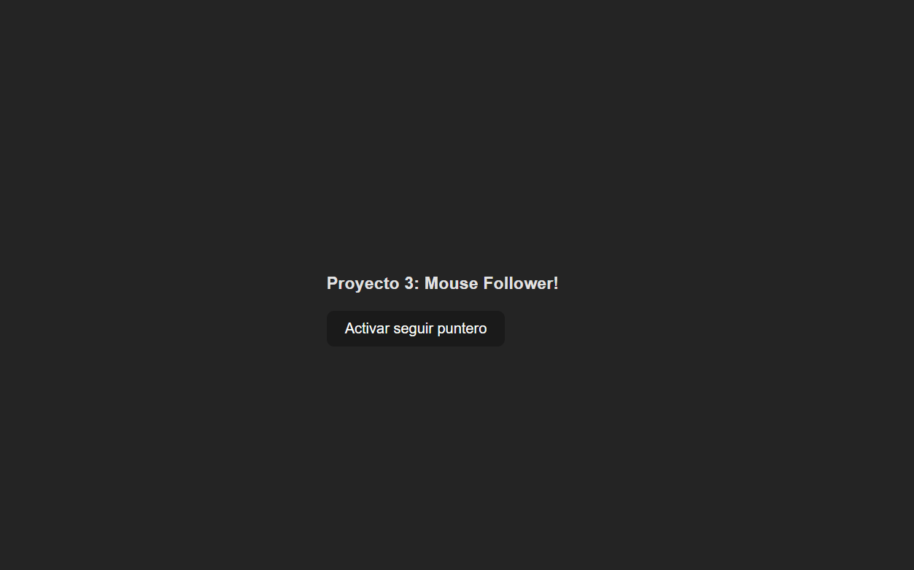

# My React Mini-Apps Collection

Welcome to my GitHub repository, a growing collection of small React projects designed to practice key concepts and patterns. Each folder contains an independent app with its own README detailing setup, usage, and insights.

---

## 📋 Projects Overview

| Project Name                   | Description                                                                                                                        | Status      |
|--------------------------------|------------------------------------------------------------------------------------------------------------------------------------|-------------|
| 01-twitter-follow-card         | A follow card component to simulate Twitter UX                                                                                     | Complete    |
| 02-tic-tac-toe                 | Classic Tic-Tac-Toe game with state management                                                                                     | Complete    |
| 03-mouse-follower              | Cursor follower animation using React hooks                                                                                        | Complete    |
| 04-react-prueba-tecnica        | Fetches a random cat fact, extracts the first word, and displays a cat image with that word using two APIs                         | Complete    |
| 05-react-buscador-peliculas    | Movie search using the OMDb API (automatic search input, responsive grid layout, displays title, year, and poster; debounced to prevent continuous and duplicate searches) | In Progress |

---

## 📽️ Demos:

### 01-twitter-follow-card  

### 02-tic-tac-toe  

### 03-mouse-follower  

### 04-react-prueba-tecnica  

### 05-react-buscador-peliculas  

